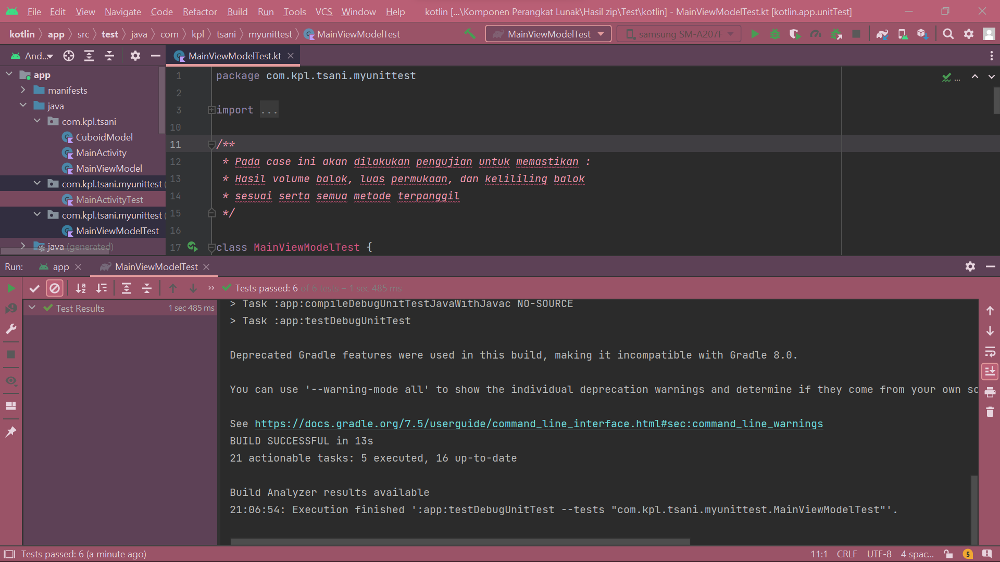

Nama  : Tsani Aflah
 NPM   : 2008107010015 
 Tugas Mata Kuliah Kualitas Perangkat Lunak 

<h1>JUnit Aplikasi Android Sederhana</h1>
1. <b> Unit Test - module-name/src/test/java/ </b>
 Unit test adalah tahapan testing yang menguji suatu komponen/unit dari aplikasi secara individu. Individual komponen/unit di sini bisa diartikan sebagai suatu class, satu method, atau bahkan satu module.
Pada saat menjalankan unit test pada code ini akan menghasilkan:
     

2. <b> UI Test - module-name/src/androidTest/java/ </b>
 UI Test adalah sebuah mekanisme di mana aplikasi akan diuji sesuai dengan kondisi user/pengguna ketika berinteraksi pada sebuah aplikasi. 
Pada saat menjalankan UI test pada code ini akan menghasilkan:
     
